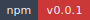

<!-- markdownlint-disable MD013 MD033 -->
<!-- This file is generated by Paradox. Do not edit manually. -->

# @ankhorage/studio

        

Standalone Studio authoring package for Ankhorage apps.

## Usage

### Start Studio

```ts
  // 1. Start DEV server at localhost:8081
  bun run dev

  // 2. Start Studio in new terminal tab
  cd apps/studio && bun start
  ```

Source: `src/cli/index.ts`

```ts
import { dirname, resolve } from 'node:path';
import { fileURLToPath } from 'node:url';

import type { AnkhCommandHandler, AnkhRuntimeCommandProvider } from '@ankhorage/ankh';

import { createStudioHost } from '../host/createStudioHost';
import { startStudioHostServer } from '../host/http/server';
import type { ProjectTemplateSelection } from '../host/templateRegistry';
import { resolveWorkspaceRoot } from '../host/utils/workspaceRoot';

const STUDIO_PACKAGE_NAME = '@ankhorage/studio';
const STUDIO_COMMAND_CATEGORY = 'studio';
const STUDIO_PACKAGE_VERSION = '0.0.21';

const STUDIO_CAPABILITIES = [
  'studio.dev',
  'studio.projects.list',
  'studio.projects.create',
  'studio.projects.delete',
  'studio.projects.sync',
  'studio.workspace.install',
] as const;

const COMMANDS = [
  {
    path: ['dev'],
    capability: 'studio.dev',
    summary: 'Start the local Studio host and first-party Studio app.',
    examples: ['ankh studio dev'],
  },
  {
    path: ['projects', 'list'],
    capability: 'studio.projects.list',
    summary: 'List projects in the Studio workspace.',
    examples: ['ankh studio projects list'],
  },
  {
    path: ['projects', 'create'],
    capability: 'studio.projects.create',
    summary: 'Create a Studio project from a template.',
    examples: ['ankh studio projects create --name Shop --category commerce --template blank'],
  },
  {
    path: ['projects', 'delete'],
    capability: 'studio.projects.delete',
    summary: 'Delete a Studio project.',
    examples: ['ankh studio projects delete shop'],
  },
  {
    path: ['projects', 'sync'],
    capability: 'studio.projects.sync',
    summary: 'Synchronize generated app host files.',
    examples: ['ankh studio projects sync shop'],
  },
  {
    path: ['workspace', 'install'],
    capability: 'studio.workspace.install',
    summary: 'Install packages required by the Studio workspace.',
    examples: ['ankh studio workspace install'],
  },
] as const;

type CommandPath = (typeof COMMANDS)[number]['path'];

const handlers = [
  createHandler(['dev'], runStudioDev),
  createHandler(['projects', 'list'], listProjects),
  createHandler(['projects', 'create'], createProject),
  createHandler(['projects', 'delete'], deleteProject),
  createHandler(['projects', 'sync'], syncProject),
  createHandler(['workspace', 'install'], installWorkspacePackages),
] as const;

function createHandler(path: CommandPath, handler: AnkhCommandHandler) {
  return { path, handler };
}

const provider = {
  id: STUDIO_PACKAGE_NAME,
  category: STUDIO_COMMAND_CATEGORY,
  version: STUDIO_PACKAGE_VERSION,
  capabilities: [...STUDIO_CAPABILITIES],
  commands: COMMANDS,
  handlers,
} satisfies AnkhRuntimeCommandProvider;

export default provider;

function resolvePackageRoot() {
  return resolve(dirname(fileURLToPath(import.meta.url)), '../..');
}

function resolveHostWorkspaceRoot() {
  return resolveWorkspaceRoot(resolvePackageRoot());
}

async function runStudioDev() {
  const packageRoot = resolvePackageRoot();
  const projectRoot = resolveWorkspaceRoot(packageRoot);
  const host = await startStudioHostServer({ projectRoot, host: '127.0.0.1', port: 3000 });
  const subprocess = Bun.spawn(['bun', 'run', 'dev:studio'], {
    cwd: packageRoot,
    stdin: 'inherit',
    stdout: 'inherit',
    stderr: 'inherit',
  });

  const shutdown = () => {
    if (!subprocess.killed) subprocess.kill('SIGTERM');
  };
  process.once('SIGINT', shutdown);
  process.once('SIGTERM', shutdown);

  try {
    return { exitCode: await subprocess.exited };
  } finally {
    process.off('SIGINT', shutdown);
    process.off('SIGTERM', shutdown);
    shutdown();
    await host.close();
  }
}

async function listProjects(request: Parameters<AnkhCommandHandler>[0]) {
  const studioHost = createStudioHost({ workspaceRoot: resolveHostWorkspaceRoot() });
  try {
    const projects = await studioHost.projectManager.listProjects();
    request.context.writeStdout(`${JSON.stringify(projects, null, 2)}
`);
    return { exitCode: 0 };
  } finally {
    await studioHost.close();
  }
}

async function createProject(request: Parameters<AnkhCommandHandler>[0]) {
  const input = parseCreateProjectArgs(request.argv);
  const studioHost = createStudioHost({ workspaceRoot: resolveHostWorkspaceRoot() });
  try {
    const project = await studioHost.projectManager.createProject(
      input.name,
      { category: input.category, templateId: input.templateId },
      (projectId) => studioHost.moduleManager.generateModuleRegistry(projectId),
    );
    request.context.writeStdout(`${JSON.stringify(project, null, 2)}
`);
    return { exitCode: 0 };
  } finally {
    await studioHost.close();
  }
}

async function deleteProject(request: Parameters<AnkhCommandHandler>[0]) {
  const projectId = requireProjectId(request.argv, 'projects delete');
  const studioHost = createStudioHost({ workspaceRoot: resolveHostWorkspaceRoot() });
  try {
    const result = await studioHost.projectManager.deleteProject(projectId);
    request.context.writeStdout(`${JSON.stringify(result, null, 2)}
`);
    return { exitCode: 0 };
  } finally {
    await studioHost.close();
  }
}

async function syncProject(request: Parameters<AnkhCommandHandler>[0]) {
  const projectId = requireProjectId(request.argv, 'projects sync');
  const studioHost = createStudioHost({ workspaceRoot: resolveHostWorkspaceRoot() });
  try {
    const result = await studioHost.moduleManager.syncProject({ projectId, includeStudio: true });
    request.context.writeStdout(`${JSON.stringify(result, null, 2)}
`);
    return { exitCode: 0 };
  } finally {
    await studioHost.close();
  }
}

async function installWorkspacePackages(request: Parameters<AnkhCommandHandler>[0]) {
  const studioHost = createStudioHost({ workspaceRoot: resolveHostWorkspaceRoot() });
  try {
    const result = await studioHost.projectManager.installWorkspacePackages();
    request.context.writeStdout(`${JSON.stringify({ ...result, scope: 'workspace' }, null, 2)}
`);
    return { exitCode: 0 };
  } finally {
    await studioHost.close();
  }
}

function requireProjectId(argv: readonly string[], command: string) {
  const [projectId] = argv;
  if (projectId === undefined || projectId.trim() === '') {
    throw new Error(`Usage: ankh studio ${command} <projectId>`);
  }
  return projectId;
}

function parseCreateProjectArgs(argv: readonly string[]): {
  name: string;
  category: ProjectTemplateSelection['category'];
  templateId: string;
} {
  const name = readFlag(argv, '--name');
  const category = readFlag(argv, '--category');
  const templateId = readFlag(argv, '--template');
  if (name === null || category === null || templateId === null) {
    throw new Error(
      'Usage: ankh studio projects create --name <name> --category <category> --template <templateId>',
    );
  }
  return { name, category: category as ProjectTemplateSelection['category'], templateId };
}

function readFlag(argv: readonly string[], flag: string) {
  const index = argv.indexOf(flag);
  const value = index === -1 ? undefined : argv[index + 1];
  return value === undefined || value.trim() === '' ? null : value;
}
```

## Generated documentation

- [Interactive documentation app](././paradox/index.html)
- [Public API reference](././paradox/exports.md)
- [Component registry](././paradox/components.md)
- [Architecture overview](././paradox/diagrams/architecture-overview.mmd)
- [Module relationships](././paradox/diagrams/module-relationships.mmd)
- [Export graph](././paradox/diagrams/export-graph.mmd)
- [addNodeToTree sequence](././paradox/diagrams/sequences/add-node-to-tree.mmd)
- [buildInsertCatalogEntries sequence](././paradox/diagrams/sequences/build-insert-catalog-entries.mmd)
- [cloneWithNewIds sequence](././paradox/diagrams/sequences/clone-with-new-ids.mmd)
- [createNodeFromCatalogEntry sequence](././paradox/diagrams/sequences/create-node-from-catalog-entry.mmd)
- [findNodeById sequence](././paradox/diagrams/sequences/find-node-by-id.mmd)
- [resolveInsertPlacement sequence](././paradox/diagrams/sequences/resolve-insert-placement.mmd)
- [updateNodeInTree sequence](././paradox/diagrams/sequences/update-node-in-tree.mmd)
- [validateInsertRecipe sequence](././paradox/diagrams/sequences/validate-insert-recipe.mmd)
- [validateNodePlacement sequence](././paradox/diagrams/sequences/validate-node-placement.mmd)
